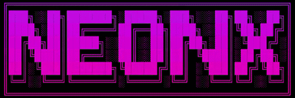

<!-- ────────────────────────────────────────────────
     NeonX — Shader Engine de Terminal Profissional
     README v2.2.6-STABLE
     ──────────────────────────────────────────────── -->

<div align="center">

<h1>
  
   NeonX
</h1>

**Uma Shader Engine de Terminal Profissional
rápido, bonito e multi‑plataforma**

[](https://github.com/inrryoff/NeonX/releases)
[](https://neonx-web.netlify.app/)
[]()
[](./LICENSE)
[](https://github.com/inrryoff/NeonX/actions/workflows/tests.yml)

<br>


</div>

---

## ✨ O que é o NeonX?

O **NeonX** transforma textos comuns em animações coloridas diretamente no terminal ou no navegador.  
Escrito do zero em **C puro**, ele usa matemática de ponto fixo e shaders procedurais para garantir **desempenho máximo** e **consumo mínimo de recursos**.

<div align="center">
  
</div>

---

## 🆚 Comparando o NeonX

> **Por que mais um colorizador de terminal?**
> Porque nenhum dos existentes resolvia o problema raiz — e o NeonX não é um colorizer: é uma **engine de renderização procedural para terminal**.

### O problema que os outros não resolveram

Todas as alternativas ao lolcat original — versões em Go, Rust, C — ficaram mais rápidas, mas mantiveram a mesma arquitetura: renderização **linha a linha**. Um banner de 5 linhas = 5 operações sequenciais. O resultado prático: 25 segundos para abrir o terminal com um banner ASCII animado.

O NeonX calcula e emite o frame **inteiro de uma vez**, tratando o terminal como um canvas 2D, não como um fluxo de linhas.

---

### Comparativo de recursos

<details>
<summary>Ver Tabela</summary>

| Recurso | lolcat (Ruby) | lolcat-c (C) | bat (Rust) | grc (Python) | **NeonX** |
|---|:---:|:---:|:---:|:---:|:---:|
| Modos de animação | 1 | 1 | — | — | **12** |
| Presets temáticos | ✗ | ✗ | temas de sintaxe | ✗ | **21** |
| Cores hex customizáveis | hue apenas | ✗ | ✗ | via regex | **`--color1` / `--color2`** |
| Controle de FPS | `-s speed` | ✗ | ✗ | ✗ | **`-F [fps]`** |
| Ângulo do gradiente | ✗ | ✗ | ✗ | ✗ | **`-A [0–360°]`** |
| Modo stream (`tail -f`) | parcial | ✗ | ✗ | parcial | **`-L` dedicado** |
| WebAssembly | ✗ | ✗ | ✗ | ✗ | **✓ (beta)** |
| Windows nativo | ✗ | recompilação | ✓ | ✗ | **✓ x64 + x86** |
| Android / Termux | ✗ | ✗ | ✓ | ✗ | **✓ ARM64 + ARM32** |
| Internacionalização | ✗ | ✗ | parcial | ✗ | **19 idiomas** |
| Verificação de integridade | ✗ | ✗ | ✗ | ✗ | **Ed25519 + BLAKE2b** |
| API como biblioteca C | ✗ | sem API pública | ✗ | ✗ | **`neonx.h`** |
| Aritmética de ponto fixo | ✗ | ✗ | ✗ | ✗ | **Q16.16** |
| Dependências externas | Ruby + gems | zero | Cargo | Python | **zero** |
| Status de manutenção | inativo (2020) | manutenção mínima | ativo | baixa atividade | **ativo** |
</details>

<div align="center">
  
</div>

---

### Diferenças técnicas principais

**Aritmética de ponto fixo Q16.16**
Todos os shaders do NeonX usam inteiros de 32 bits — sem `float`, sem `double`. Isso garante comportamento idêntico em qualquer arquitetura, incluindo ambientes WASM sem FPU dedicada. O lolcat e suas reimplementações usam ponto flutuante.

**12 modos de shader vs 1**
O lolcat implementa um único algoritmo senoidal. O NeonX oferece 12 modos distintos: gradiente horizontal, sunset vertical, ondas, plasma, matrix com scanlines, radial e outros — cada um com matemática procedural própria.

**21 presets temáticos**
Associam automaticamente modo de shader + paleta RGB + ângulo. Exemplos: `cyberpunk`, `matrix`, `dracula`, `rose`, `toxic`, `hacker`. Nenhuma outra ferramenta da categoria oferece presets nomeados.

**Verificação de integridade**
O binário carrega e valida sua própria assinatura Ed25519 via Monocypher (BLAKE2b). Inédito na categoria de colorizadores de terminal.

---

### Quando usar o NeonX vs as alternativas

<details>
<summary>Ver Tabela</summary>

| Situação | Recomendação |
|---|---|
| Só quer arco-íris rápido, sem configuração | `lolcat-c` (jaseg) |
| Syntax highlighting de código-fonte | `bat` |
| Colorir saída de comandos específicos (ip, df, dig) | `grc` |
| Banner ASCII animado no terminal | **NeonX** |
| Logs em tempo real com estética (`tail -f`) | **NeonX** com `-L` |
| Precisão multiplataforma (WASM, ARM, Windows) | **NeonX** |
| Integrar colorização como biblioteca C | **NeonX** via `neonx.h` |
| Personalização total de cor, ângulo e FPS | **NeonX** |
</details>

---

> 🌐 **[Ver comparativo completo com análise detalhada →](https://neonx-web.netlify.app/)**

---

## 🆕 Novidades da v2.2.6‑STABLE

- **Presets:** Novos Presets adicionados a lista, veja velogo a baixo na seção de **🎨 Presets**

---

## 📦 Instalando e Compilando você mesmo

```bash
git clone https://github.com/inrryoff/NeonX.git
cd NeonX
make
sudo make install
```

### Ou utilize o build.sh (recomendado)

```bash
# Clone o repositório
git clone https://github.com/inrryoff/NeonX.git
cd NeonX

# Compile usando o builder Shell
./build.sh
# E siga instruções no menu.
# Se quiser fazer testes, use --test
```

---

## 📦 Instalação já compilada (oficial)

Escolha sua plataforma e siga as instruções para instalar a versão **v2.2.6-STABLE**:

### 🐧 Linux
<details>
<summary>Visualizar instruções</summary>

```bash
# 1. Baixe o pacote x64
curl -LO https://github.com/inrryoff/NeonX/releases/download/v2.2.6/neonx_linux-x64.zip

# 2. Extraia e instale
unzip neonx_linux-x64.zip
sudo mv neonx /usr/local/bin/
sudo chmod +x /usr/local/bin/neonx
```
</details>

### 🤖 Android (Termux)
<details>
<summary>Visualizar instruções</summary>

```bash
# 1. Baixe o pacote ARM64
curl -LO https://github.com/inrryoff/NeonX/releases/download/v2.2.6/neonx_linux-arm64.zip

# 2. Extraia e instale no PATH do Termux
unzip neonx_linux-arm64.zip
mv neonx $PREFIX/bin/
chmod +x $PREFIX/bin/neonx
```
</details>

### 🍏 macOS
<details>
<summary>Visualizar instruções</summary>

```bash
# 1. Baixe o pacote (arm64 para Apple Silicon)
curl -LO https://github.com/inrryoff/NeonX/releases/download/v2.2.6/neonx_macos-arm64.zip

# 2. Extraia e remova a quarentena
unzip neonx_macos-arm64.zip
sudo mv neonx /usr/local/bin/
sudo chmod +x /usr/local/bin/neonx
sudo xattr -d com.apple.quarantine /usr/local/bin/neonx
```
</details>

### 🪟 Windows (CMD & PowerShell)
<details>
<summary>Visualizar via CMD</summary>

```cmd
:: 1. Baixe usando curl nativo do Windows
curl.exe -LO https://github.com/inrryoff/NeonX/releases/download/v2.2.6/neonx_windows-x64.zip

:: 2. Extraia e mova para o System32 (necessário Admin)
tar -xf neonx_windows-x64.zip
move neonx.exe C:\Windows\System32\
```
</details>

<details>
<summary>Visualizar via PowerShell</summary>

```powershell
# 1. Baixe o pacote
curl.exe -LO https://github.com/inrryoff/NeonX/releases/download/v2.2.6/neonx_windows-x64.zip

# 2. Extraia e instale globalmente
Expand-Archive neonx_windows-x64.zip -DestinationPath . -Force
Move-Item -Path ".\neonx.exe" -Destination "C:\Windows\System32\" -Force
```
</details>

### 🌐 WebAssembly (WASM)
<details>
<summary>Visualizar instruções</summary>

O NeonX agora pode ser rodado diretamente no navegador como uma biblioteca.
```bash
# 1. Baixe o pacote WASM
curl -LO https://github.com/inrryoff/NeonX/releases/download/v2.2.6/neonx_wasm.zip

# 2. Extraia e rode um servidor local para testar
unzip neonx_wasm.zip
python3 -m http.server 8080
# Acesse http://localhost:8080 no seu navegador
```
</details>

---

## 📖 Guia de Uso

### Exemplos básicos

```bash
# Animação padrão
cat banner.txt | neonx

# Cores personalizadas
cat banner.txt | neonx -d 5 --color1 "#FF0000" --color2 "#FFA500"

# Logs em tempo real com preset
tail -f access.log | neonx --preset dracula -L

# Frame estático
echo "NeonX Engine" | neonx --preset synthwave -S
```

<div align="center">
  
</div>

---

## 🛠️ Opções de linha de comando

<details>
<summary>Ver Tabela</summary>

| Opção | Descrição | Padrão |
|-------|-----------|--------|
| `-m [0-11]` | Modo de animação (0–11) | `0` |
| `-s [valor]` | Velocidade da transição | `0.2` |
| `-f [valor]` | Frequência da onda | `0.3` |
| `-d [seg]` | Duração total (`0` = infinito) | `0` |
| `-max-lines [val]` | Limite máximo de linhas | `10000` |
| `-A [graus]` | Ângulo do gradiente (0–360) | `0` |
| `-p, -P [valor]` | Seed fixa (determinística) | — |
| `-S` | Modo estático (apenas o primeiro frame) | desligado |
| `-c [largura]` | Força largura estática do gradiente | — |
| `-o [0-1]` | Opacidade horizontal / suavidade | `0.0` |
| `-O [0-1]` | Opacidade vertical (fading topo/base) | `0.0` |
| `-F [fps]` | Taxa de quadros por segundo | `20` |
| `-L` | Modo stream (linha a linha, ideal para `tail -f`) | desligado |
| `--fo [0-1]` | Modo fosco (reduz vivacidade) | `0` |
| `--preset [nome]` | Aplica um preset temático (ver tabela abaixo) | — |
| `--color1 [hex]` | Cor inicial do gradiente (ex: `#FF0000`) | — |
| `--color2 [hex]` | Cor final do gradiente (ex: `#FFA500`) | — |
| `--c1 [hex]`, `--c2 [hex]` | Atalhos para `--color1` e `--color2` | — |
| `--quantized` | Quantização de cores (maior performance) | desligado |
| `--no-ansi` | Desativa cores ANSI na saída | desligado |
| `--spin` | Gera apenas códigos ANSI puros (para scripts) | desligado |
| `--lang [código]` | Força o idioma (`pt`, `en`, `ja`, etc.) | automático |
| `--license` | Exibe os termos de licenciamento | — |
| `-v, --version` | Mostra versão e status do binário | — |
| `-h, --help` | Exibe este painel de ajuda interativo | — |
</details>

> **Observação:** Existe uma flag oculta (não documentada) que força o binário a reler a si mesmo e verificar sua integridade. O comando retornará o status no idioma atual: `OK` se íntegro, `FAIL` se modificado, ou uma mensagem de erro caso não seja possível ler o próprio executável.

<div align="center">
  
</div>

---

## 🎨 Presets

<details>
<summary>Ver Tabela</summary>

Os presets definem um **modo de animação**, **paleta de cores** e **ângulo** específicos.  
A tabela abaixo descreve exatamente o que cada um faz, com base nos parâmetros internos.

| Preset | Modo | Paleta (comportamento das cores) | Ângulo |
|---|---|---|---|
| cyberpunk | 0 (horizontal) | Arco-íris tradicional | 45° |
| retro | 4 (ondas) | Paleta quente (vermelho / laranja) | 0° |
| matrix | 10 (shader matrix) | Verde com scanlines e brilho | 90° |
| sunset | 1 (sunset) | Tons quentes de pôr-do-sol | 30° |
| vaporwave | 3 | Rosa / roxo suave | 75° |
| ocean | 6 | Azul / verde oceânico | 50° |
| forest | 2 | Verde floresta | 25° |
| blood | 8 | Vermelho intenso | 0° |
| hacker | 0 (horizontal) | Verde terminal clássico | 0° |
| synthwave | 3 | Roxo / rosa neon | 90° |
| dracula | 1 (sunset) | Roxo escuro / tons sombrios | 45° |
| aurora | 5 | Verde e azul claro (estilo aurora boreal) | 0° |
| neon_tokyo | 4 (ondas) | Rosa e roxo vibrante | 0° |
| lava | 8 | Laranja e vermelho incandescente | 0° |
| ice | 11 | Azul e ciano gelado | 0° |
| fire | 3 | Cores quentes de chamas (vermelho/amarelo) | 0° |
| galaxy | 5 | Roxo e azul profundo espacial | 0° |
| toxic | 10 (shader matrix) | Verde radioativo / venenoso | 0° |
| midnight | 0 (horizontal) | Azul noturno escuro | 40° |
| rose | 1 (sunset) | Tons de rosa e avermelhado | 0° |
| vapor2 | 6 | Tons pastéis vibrantes de azul e rosa | 0° |
</details>

<div align="center">
  
</div>

---

## 🌐 Idiomas suportados

Use o **código de dois caracteres** com `--lang`.  
**Exemplo:** `neonx --lang pt` (português), `neonx --lang ja` (japonês).

<details>
<summary>Ver Tabela</summary>
| Código | Idioma | Código | Idioma |
|:---|:---|:---|:---|
| `pt` | Português | `en` | Inglês |
| `es` | Espanhol | `fr` | Francês |
| `de` | Alemão | `it` | Italiano |
| `ru` | Russo | `zh` | Chinês |
| `ja` | Japonês | `ko` | Coreano |
| `tr` | Turco | `pl` | Polonês |
| `id` | Indonésio | `ar` | Árabe |
| `bg` | Búlgaro | `el` | Grego |
| `hi` | Hindi | `th` | Tailandês |
| `km` | Khmer | | |
</details>

> O idioma é detectado automaticamente; `--lang` força um específico.

---

## 🏗️ NeonX como biblioteca

```c
#include "neonx.h"

RenderDriver driver = {
    .set_color   = my_set_color,
    .reset_color = my_reset_color,
    .put_char    = my_put_char,
    .ctx         = my_context
};

neonx_render_line(L"Hello", 5, y_fixed, phase, mode, cx, cy, max_dist, &driver);
```

Documentação completa em [ARCHITECTURE.md](./ARCHITECTURE.md).

---

## 💖 Apoie o projeto

- ⭐ **Dê uma estrela** no [GitHub](https://github.com/inrryoff/NeonX)
- ☕ **Doação**: [Clique aqui](https://tipa.ai/TIPARYITV51W4R3SLEG22KVVK9I1)
- 👨🏻‍💻 **GitHub**: [@inrryoff](https://github.com/inrryoff)
- 👨🏻‍💻 **Telegram**: [@inrryoff](https://t.me/inrryoff)

---

## 📄 Licença

Licença customizada. Veja [LICENSE](./LICENSE).

---

## 📖 A História do NeonX

O NeonX nasceu de uma frustração específica, não de uma vontade de "fazer um lolcat melhor".

Eu uso um banner de boas-vindas no meu terminal — um ASCII art de 5 linhas. Com o lolcat e as ferramentas que eu testava na época, esse banner era renderizado **linha por linha**: cada linha aparecia individualmente, uma atrás da outra, como se o terminal estivesse digitando em câmera lenta. Um frame de 5 linhas multiplicava o tempo por 5. O resultado? **25 segundos para abrir o meu próprio terminal.**

Tentei várias alternativas — versões do lolcat em Go, Rust, C. Todas mais rápidas que o original em Ruby, sim, mas nenhuma resolvia o problema raiz: o rendering **line-by-line** e a falta de controle real sobre a animação. Um script em Python que encontrei reduziu para 15 segundos. Melhor, mas ainda inaceitável. Eu queria abrir o terminal e ver o banner inteiro animado em **5 segundos limpos** — não uma linha por vez.

Foi aí que percebi: nenhuma dessas ferramentas foi projetada para o que eu precisava. Elas são colorizers — pegam texto e jogam cor em cima. O problema que eu tinha exigia outra coisa: uma **engine de renderização procedural para terminal**, capaz de calcular e exibir um frame completo de uma vez.

Então decidi construir isso do zero, em C puro, desenvolvido no **Termux** (Android) — o que diz bastante sobre as restrições que eu tinha e as que o projeto precisava respeitar.

<div align="center">
  
</div>

---

### Por que C puro?

Sem dependências externas, zero overhead de runtime, portável para qualquer plataforma que tenha um compilador. Eu não tinha experiência prévia em C quando comecei — tive que aprender a linguagem enquanto construía o projeto. Foi um investimento real de tempo e dedicação.

A escolha de **aritmética de ponto fixo Q16.16** (sem `float` ou `double` em nenhum shader) garante comportamento consistente em qualquer plataforma — incluindo ambientes sem FPU dedicada, como alguns contextos WASM.

---

### Sobre a licença restritiva

A licença do NeonX é **Source Available**, não MIT ou GPL — e isso é uma escolha deliberada que merece explicação.

Eu investi dinheiro e tempo real neste projeto. A licença restritiva é o jeito que encontrei de me sentir protegido contra dois cenários específicos: **forks comerciais sem crédito** e **empresas grandes que peguem o código, vendam e não contribuam de volta**. Sei que não é perfeito — nenhuma licença é — mas é o mínimo que pude fazer para proteger meu esforço.

Dito isso: **eu amo a comunidade open source**. O NeonX é de graça para uso pessoal, para desenvolvedores independentes, para projetos indie — mesmo que esses projetos sejam pagos. Se você investiu tempo e dinheiro no seu projeto e quer cobrar por ele, eu entendo e respeito isso, da mesma forma que peço que respeitem o meu trabalho.

O que a licença proíbe é a **venda direta do NeonX em si** sem autorização. Distribuição, integração, uso — liberado.

Uma consequência direta dessa escolha é que a inclusão em repositórios oficiais de distribuições (apt, pkg, apk, brew) será difícil ou impossível enquanto a licença for Source Available. Eu sei disso e estou pensando no assunto — mas por enquanto, a proteção que a licença oferece ainda vale mais para mim do que a facilidade de instalação.

---

### O que vem pela frente

- **WASM**: ainda em beta, será estabilizado e aprimorado. A ideia de rodar a engine no navegador sem modificar nada é algo que quero levar a sério.
- **Melhor suporte multiplataforma**: mais arquiteturas, melhor experiência em cada uma.
- **Gradientes RGB aprimorados**: novos modos de shader e mais controle sobre as transições de cor.
- **Otimização de transmissão**: o verdadeiro gargalo não é o código — é o próprio `tty/pty`, que não aguenta mais que ~4KB de dados. Ainda estou pensando em como reduzir o volume de dados que passo por esse funil sem sacrificar a qualidade visual.
- **Biblioteca oficial**: transformar o NeonX em uma lib com API estável, distribuível via gerenciadores de pacotes.

---

> Se você chegou até aqui e achou que o projeto tem uma natureza "altamente defensiva" — com verificação de assinatura embutida, sistema de integridade, licença customizada — você não está errado. Mas isso não é paranoia: é o mínimo que um desenvolvedor solo, sem empresa por trás, pode fazer para proteger algo em que investiu de verdade. O projeto é jovem, eu sou jovem no C, e ainda estou construindo. A intenção sempre foi — e continuará sendo — servir a comunidade.

<div align="center">
  <sub>Feito com ☕ e C, no ritmo do terminal.</sub>
  <br>
  <sub>© 2026-presente, inrryoff</sub>
</div>
